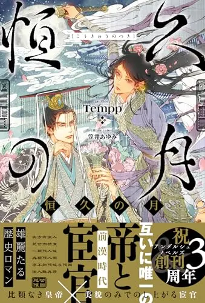
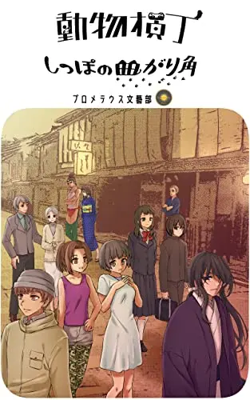

Under Construction

## 発売書籍

  <a class="profile-book-banner" href="https://www.amazon.co.jp/dp/4434340352" target="_blank" rel="noopener noreferrer">
    <strong>恒久の月</strong><small>Amazon.co.jp</small>
    
  </a>
  <a class="profile-book-banner" href="https://www.amazon.co.jp/dp/B0BMWNSDLL" target="_blank" rel="noopener noreferrer">
    <strong>官能アンソロジー: 十二月恋奇譚</strong><small>Amazon.co.jp</small>
    
  </a>
  <a class="profile-book-banner" href="https://www.amazon.co.jp/dp/B0C91MS8TS" target="_blank" rel="noopener noreferrer">
    <strong>動物横丁 しっぽの曲がり角</strong><small>Amazon.co.jp</small>
    
  </a>

## 受賞・紹介一覧（順不同）

- エブリスタ：大賞：ファンタジーコンテスト「ミステリアスなキャラが登場する物語」：[**デュラはんは心の友**](https://estar.jp/official_contests/159505)
- エブリスタ：大賞：新星ファンタジーコンテスト「料理/グルメ」：[**ラヴィ＝フォーティスと竜の頭と愉快な食レポの旅 1**](https://estar.jp/official_contests/159675)
- エブリスタ：準大賞：執筆応援キャンペーン「契約」：[**鎮華春分**](https://estar.jp/official_contests/159833)
- エブリスタ：佳作：新星ファンタジーコンテスト「最弱/落ちこぼれ」：[**本当は弱小ヤンキーの俺が異世界で最強と勘違いされても無双できない！**](https://estar.jp/official_contests/159738)
- エブリスタ：佳作：執筆応援キャンペーン「家庭/近所/職場のモヤモヤ」：[**わたしにたりないもの。**](https://estar.jp/official_contests/159508)
- エブリスタ：佳作：執筆応援キャンペーン「バトル/アクション/サバイバル」：[**Run, corpse run**](https://estar.jp/official_contests/159616)
- エブリスタ：佳作：「父と娘」エピソードコンテスト：[**空に落ちる 【ユフの方舟3】**](https://estar.jp/official_contests/159614)
- エブリスタ：佳作：妄想コンテスト「どきどきの理由」：[**そのノート、小説につき**](https://estar.jp/official_contests/159678)
- エブリスタ：佳作：妄想コンテスト「○○前夜」：[**思い、出戻り、恋の行方。お別れ前夜。**](https://estar.jp/official_contests/159641)
- エブリスタ：佳作：執筆応援キャンペーン「執着/独占欲」：[**あけぬ夜はなし**](https://estar.jp/official_contests/159797)
- エブリスタ：佳作：育成コンテスト「文章テクニック」：[**一人のエルフと、ある世界樹の話**](https://estar.jp/official_contests/159854)
- エブリスタ：優秀作品：妄想コンテスト「暗闇の中で」：[**スティル・イン・ザ・ダーク MOD**](https://estar.jp/official_contests/159619)
- エブリスタ：優秀作品：妄想コンテスト「復活」：[**公爵令嬢・オブ・ジ・デッド**](https://estar.jp/official_contests/159652)
- エブリスタ：ピックアップルーキー：妄想コンテスト「神様、お願い」：[**ももんがの毛**](https://estar.jp/official_contests/159485)
- エブリスタ：最終候補：集英社文庫ナツイチ小説大賞2022恋愛短編部門：[**冷たい人**](https://estar.jp/official_contests/159682)
- NOVEL DAYS：佳作：2000字文学賞「ホラー小説」：[**私と、電車のすき間の都市伝説**](https://novel.daysneo.com/award/2000jihorrorre.html)
- NOVEL DAYS：佳作：2000字文学賞「ホラー小説」：[**莉莉は墓の中**](https://novel.daysneo.com/award/2000jihorrorre.html)
- NOVEL DAYS：佳作：2000字文学賞「お仕事小説」：[**ユフの果樹園**](https://daysneo.com/award/2000jioshigotore.html)
- NOVEL DAYS：佳作：2000字文学賞「歴史・時代小説」：[**蛇の足**](https://novel.daysneo.com/award/2000jirekishire.html)
- カクヨム：三次選考通過：第30回電撃小説大賞：[**狂骨紅籠 夜な夜な訪れる髑髏の話 ～明治幻想奇譚～**](https://dengekitaisho.jp/announce/entry-273.html)
- カクヨム：紹介：カクヨムコンテスト11短編特別賞・お題フェス「天気」：[**フレデリカの名前**](https://kakuyomu.jp/contests/kakuyomu_contest_short_11)
- カクヨム：紹介：カクヨム金のたまご令和4年11～12月：[**歴史・神霊・科学・宗教な雑多関連エッセイ**](https://kakuyomu.jp/features/16817330652448598898)
- 魔法のiランド：ピックアップ：「3つの夜」から選ぶ秋の短編小説「黄昏」：**夕方屋と透明な夕焼け**
- 魔法のiランド：掲載：アドベントカレンダー小説企画2022 12月17日：**魅惑の長老ボアのルーロー飯**
- pixiv：優秀賞：「執筆応援！ワンルームSSチャレンジ2」：[**かかふかか**](https://www.pixiv.net/novel/contest/1roomnovel2)
- pixiv：編集部おすすめ作品：**雨とスイーツ**
- pixiv：編集部おすすめ作品：**旅と春風と辞書**
- ノベルアップ＋：ハード選出：イタズラ作品投稿フェア：[**謎の石**](https://novelup.plus/campaign/halloween-2022/)
- ノベルアップ＋：準入賞：Gakken×朝日中高生新聞ショートショートコンテスト：[**タイムカプセルの中身**](https://novelup.plus/event/asahi-ss-contest/)
- アルファポリス：奨励賞：第7回歴史・時代小説大賞：[**恒久の月**](https://www.alphapolis.co.jp/prize/result/279000163)
- BLove：準グランプリ：第2回BL小説・漫画コンテスト「パーティの後で」：[**遠くて近い**](https://blove.jp/contest/?id=9)
- WebマガジンCobalt：佳作：ディストピア飯小説賞：[**ユフの果樹園**](https://cobalt.shueisha.co.jp/contents/dystopian-rice_award_result/)
- Gakken：最終候補：第1回「5分後に意外な結末」大賞：[**その夏、一瞬の恋、永遠の恋**](https://gkp-koushiki.gakken.jp/2024/12/06/79529/)
